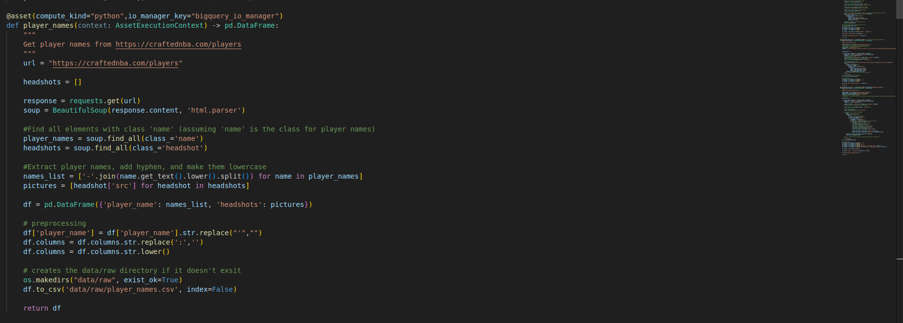

Welcome to your new dbt project!

### Crafted NBA Data Pipeline
Welcome to the Crafted NBA Data Pipeline project! 🏀 This is where data engineering meets the world of basketball, all thanks to the magic of Dagster and dbt. Where we scrape, transform, and load NBA player data from the [crafted NBA website](https://craftednba.com/players).

### How it works

## Data Scraping

Dagter is responsible for the execution of the python scraping modules. The assets are run once a month.

- The first asset, `player_names`, scrapes player names and headshots from the Crafted NBA website. Player names are transformed into a DataFrame and stored in a CSV file for further processing. The headshot URLs are also extracted and stored along with the player names.

- The `player_bio` task fetches player bio data such as height and age from the website. It iterates through player names, constructs URLs for each player, sends HTTP requests to retrieve player data, and extracts relevant information using BeautifulSoup. The extracted data is then formatted into a DataFrame.
- `player_roles` task retrieves players' positional roles from the website. Similar to `player_bio`, it iterates through player names, constructs URLs, and extracts role information using BeautifulSoup. The extracted data is stored in a DataFrame.
- The `player_stats` task collects scouting report stats for players. It follows a similar process of iterating through player names, constructing URLs, and extracting stats data using BeautifulSoup. The extracted data is stored in a DataFrame.

## Data flow

    Kafka Connect Mongo Sink consumes data from Kafka topic A and stores news in MongoDB using upsert functionality based on _id field.
    Debezium MongoDB Source tracks a MongoDB replica set for document changes in databases and collections, recording those changes as events in Kafka topic B.
    Kafka Connect Elasticsearch Sink consumes data from Kafka topic B and upserts news in Elasticsearch. Data replicated between topics A and B ensures MongoDB and ElasticSearch synchronization. Command Query Responsibility Segregation (CQRS) pattern allows the use of separate models for updating and reading information.
    Kafka Connect S3-Minio Sink consumes records from Kafka topic B and stores them in MinIO (high-performance object storage) to ensure data persistency.

## Data access

    Data gathered by previous steps can be easily accessed in API service using public endpoints.
