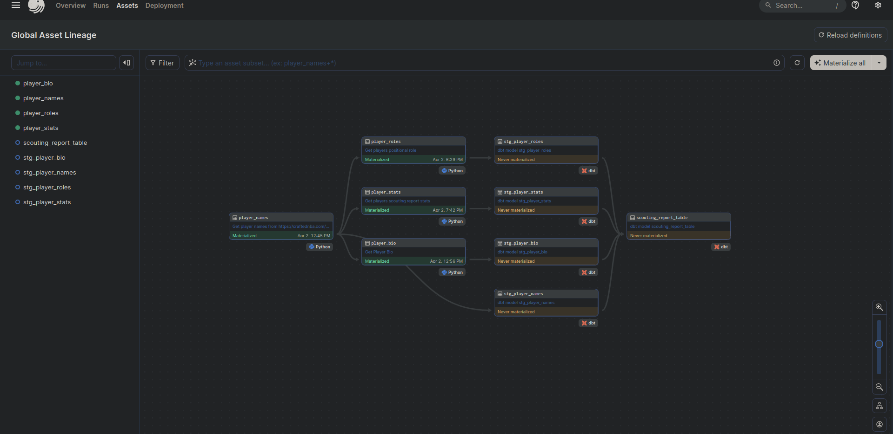

Welcome to your new dbt project!

### Crafted NBA Data Pipeline
Welcome to the Crafted NBA Data Pipeline project! 🏀 This is where data engineering meets the world of basketball, all thanks to the magic of Dagster and dbt. Where we scrape, transform, and load NBA player data from the [crafted NBA website](https://craftednba.com/players).

### How it works

## Data Scraping

Dagter is responsible for the execution of the python scraping modules. The assets are run once a month, a Dagster Asset is an object produced by a pipeline. Beautiful soup is used as the scraping tool.

- The first asset, `player_names`, scrapes player names and headshots from the Crafted NBA website. Player names are transformed into a DataFrame and stored in a CSV file for further processing. The headshot URLs are also extracted and stored along with the player names.
- The `player_bio` task fetches player bio data such as height and age from the website. It iterates through player names, constructs URLs for each player, sends HTTP requests to retrieve player data, and extracts relevant information using BeautifulSoup. The extracted data is then formatted into a DataFrame.
- `player_roles` task retrieves players' positional roles from the website. Similar to `player_bio`, it iterates through player names, constructs URLs, and extracts role information using BeautifulSoup. The extracted data is stored in a DataFrame.
- The `player_stats` task collects scouting report stats for players. It follows a similar process of iterating through player names, constructing URLs, and extracting stats data using BeautifulSoup. The extracted data is stored in a DataFrame.



## Data Transformation

Our Dagster assets contain python code that scrape data from the [crafted NBA website](https://craftednba.com/players) as well as our dbt models.
We use the outputs of our assets which are csv files as the seeds for the dbt side of this project, it contain the `player_names`, `player_bio`, `player_roles` and `player_stats` csv files.
In our `schema.yml` file at `models/core` and `models/staging`. We declare the sources of what will be our used as our seeds:

```jinja
version: 2

sources:
  - name: nba_data
    tables:
      - name: player_names
        meta:
          dagster:
            asset_key: ["player_names"] # This metadata specifies the corresponding Dagster asset for this dbt source.
      - name: player_bio
        meta:
          dagster:
            asset_key: ["player_bio"]
      - name: player_roles
        meta:
          dagster:
            asset_key: ["player_roles"]
      - name: player_stats
        meta:
          dagster:
            asset_key: ["player_stats"]
```

##  Data Storage
For data storage the project uses `dbt-bigquery`, which is dbt BigQuery integration. We as use `BigQueryPandsIOManager`. This is a Dagster BigQuery integration that helps us store a pandas dataframe into our database.
To set up `BigQueryPandasIOManager`, we declare it as resource in the `definition.py` file in our dagster directory:
```bash
defs = Definitions(
    """
    ........
    """"
    resources={
        "dbt": DbtCliResource(project_dir=os.fspath(dbt_project_dir)),
        "bigquery_io_manager": BigQueryPandasIOManager(
            project=EnvVar("PROJECT_ID"),
            location=EnvVar("LOCATION"),
            dataset="nba_data",
            gcp_credentials=EnvVar("GCP_CREDENTIALS"),
            timeout=15.0
        )
    },
)
```


4. Integration with dbt:
The nba_pipeline_dbt_assets function integrates the data pipeline with dbt (data build tool), allowing you to execute dbt commands within the context of your Dagster pipeline.
This integration enables you to leverage dbt for further data modeling, transformation, and analysis tasks, building on top of the raw data scraped and prepared by your Dagster assets.

## Data access

    Data gathered by previous steps can be easily accessed in API service using public endpoints.
